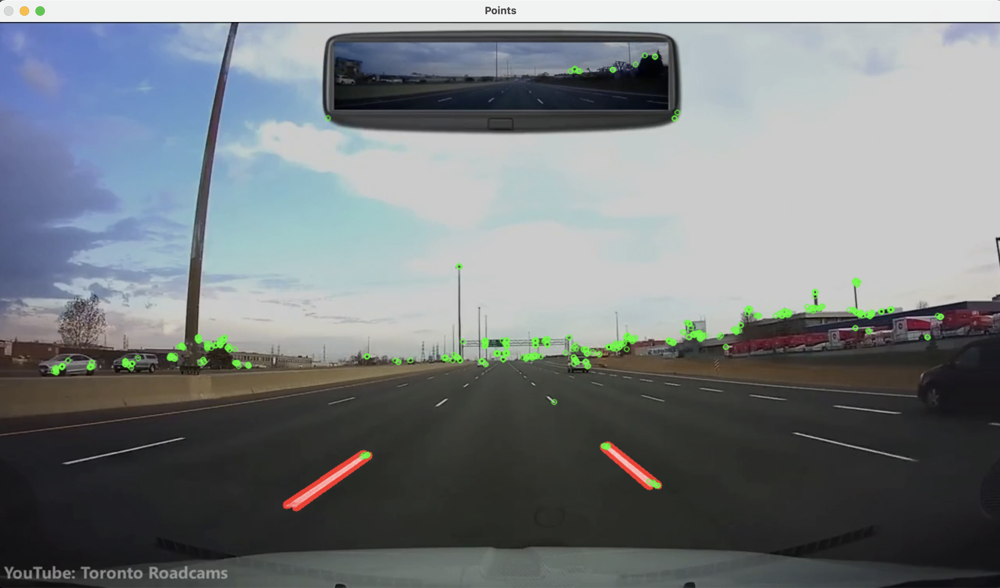
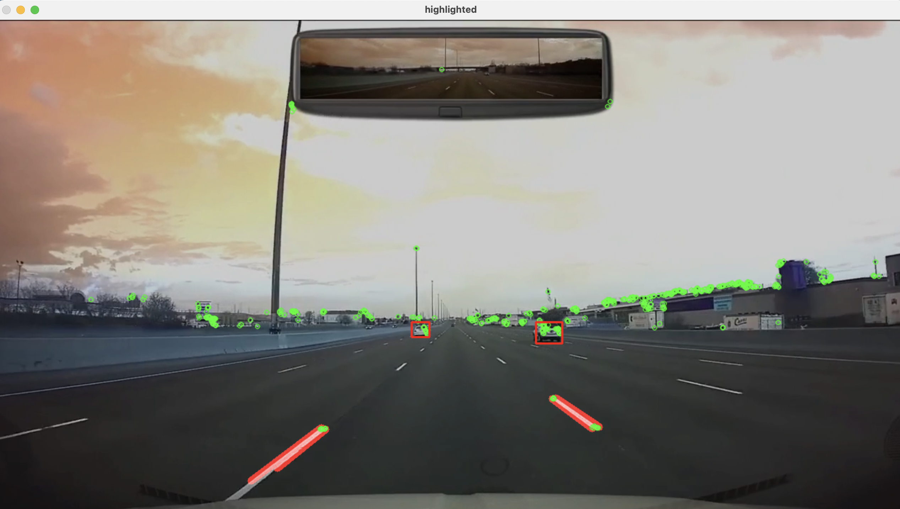

# SLAM Implementation

###  What is Slam?
SLAM stands for simultaneous localization and mapping and is the computational method for constructing or updating a map of an unknown environment while simultaneously keeping track of the location within it. For example in autonomous vehicles it lets you build a map and localize your vehicle in that map at the same time. This helps plan things like path planning and obstacle avoidance. I will be implementing a feature based slam, which is essentially tracking points in one frame and then comparing these points in various frames. 

### Dataset
The dataset I will use is a dashcam of driving on the Highway 400 in Ontario. I found this dashcam footage on YouTube and it can be found here: https://www.youtube.com/watch?v=p_DcquxYvzk

### Screenshots:

  
   

I chose this dataset to do my first test on and builld my model around because it is good quality, good lighting, and does not have many obstacles in it. The dataset is also not too small and I can accurately model it.  This dataset will be a good starting point for the model which I can optimize and further test on different datasets in different conditions. The video contains a watermark and a mirror at the top which will have to be accomodated for in preproccesing.

### To Do List
- [ ] Localization: Lane detection using canny edge detection and hough transform. May look into spatial CNN's
- [ ] Mapping: Research different mapping techniques that will be used. Focusing on Kalman Filter, Particle Filter, and Graph-SLAM
- [ ] Mapping: Look into different tracking technique such as goodFeaturesToTrack or ORB in openCV
- [ ] Match tracked points frame to frame and then estimate pose transformation
- [ ] 3D mapping of tracked points will be done on Pangolin + use of g2opy for optimization

How to use:

1. Make sure your current working directory is at the highest level file, in this case it's `SLAM-Implementation`
2. `python main.py --display highway.mp4`
